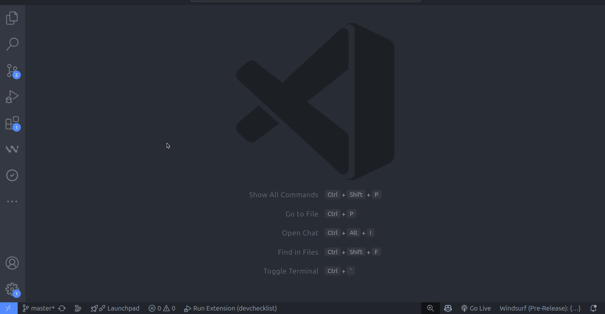
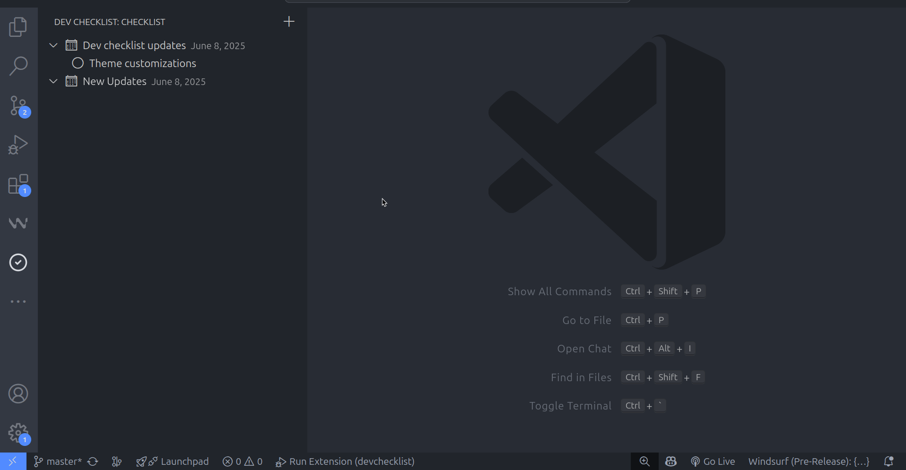
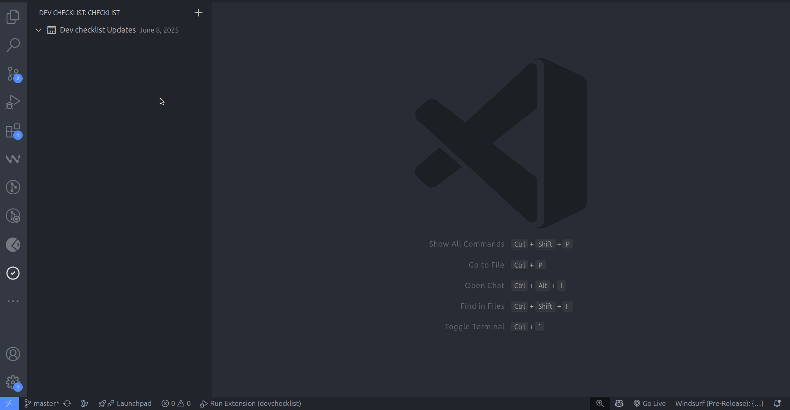

# 🧩 Dev Checklist — VS Code Extension

**Dev Checklist** is a simple, effective, and extensible checklist tool for developers directly inside Visual Studio Code. Use it to manage daily development tasks, project-specific todos, or custom onboarding checklists.

---

## 🚀 Features

- ✅ Create and manage custom checklists
- 🕒 Built-in timer for time-bound tasks
- 📁 Checklist per workspace or project
- 🔄 Persistent storage of progress
- 🎯 Keyboard shortcuts for fast actions
- 🧠 Ideal for onboarding, reviews, or deployment routines

---

## 📸 Preview

### ✍️ Add Checklist Items

### 🔁 Change Status (Complete / In Progress)

### ⏱️ Timer Start/Stop for Tasks

---

## 🛠️ Usages

1. Open the Command Palette: `Ctrl + Shift + P`
2. Search for `Dev Checklist: Open Checklist`
3. Start checking off your tasks or add new ones

You can also access the checklist in the sidebar view.

---

## 🧑‍💻 Developer Commands

| Command                          | Description                              |
|----------------------------------|------------------------------------------|
| `Dev Checklist: Add Item`        | Adds a new task to the checklist         |
| `Dev Checklist: Start Timer`     | Starts a timer for a checklist item      |
| `Dev Checklist: Reset Checklist` | Clears all checklist items               |

---

## 🔧 Extension Settings

Coming soon: customize themes, checklist groups, and timer durations.

---

## 📂 Folder Structure

_Example structure if using a media folder:_
