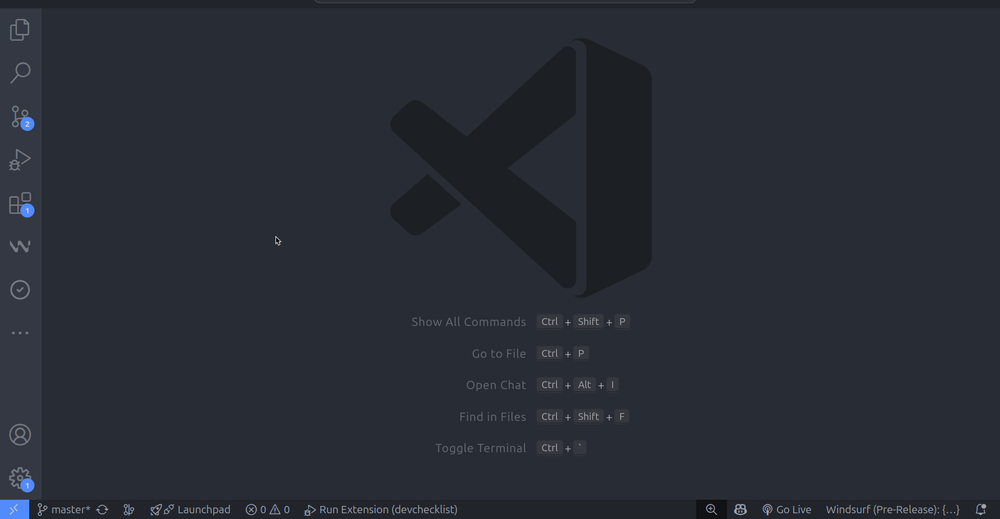
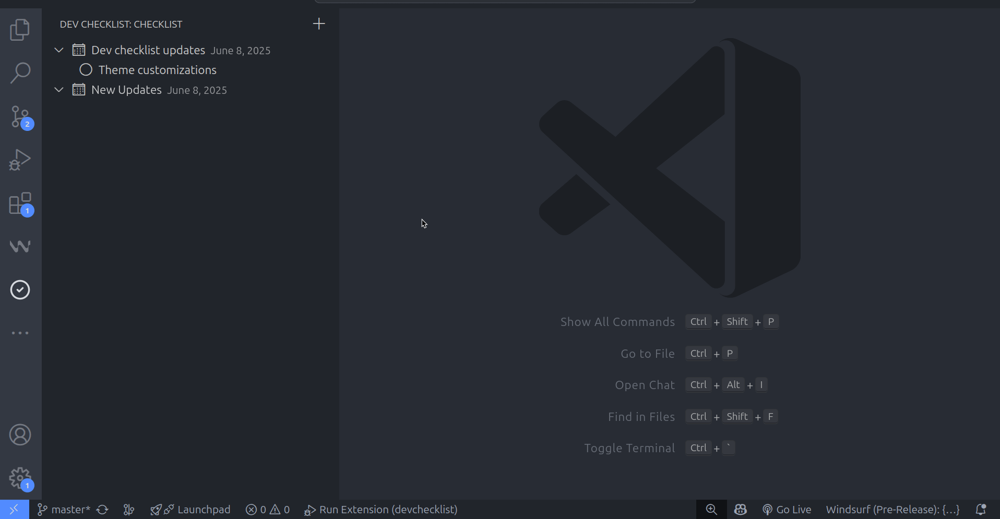
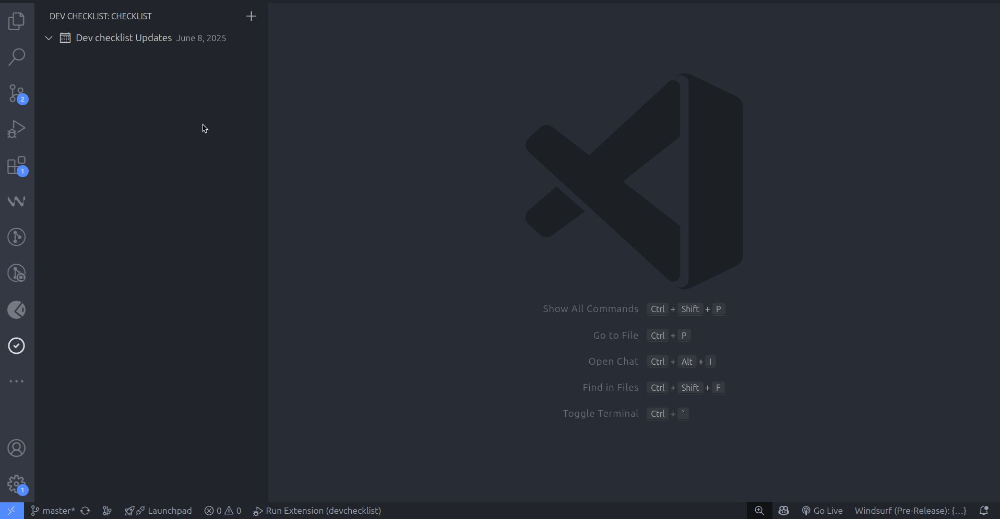

# 🧩 Dev Checklist — VS Code Extension

**Dev Checklist** is a simple, effective, and extensible checklist tool for developers directly inside Visual Studio Code. Use it to manage daily development tasks, project-specific todos, or custom onboarding checklists.

---

## 💻 New Features

- 🖍 checklist edit option.
- 🕒 task timer functionality changes.
- ⭐ Import csv and json files for tasks.

## 🚀 Extension Usages

- ✅ Create and manage custom checklists
- 🕒 Built-in timer for time-bound tasks
- 📁 Checklist per workspace or project
- 🔄 Persistent storage of progress
- 🎯 Keyboard shortcuts for fast actions
- 🧠 Ideal for onboarding, reviews, or deployment routines

---

## 📸 Preview

### ✍️ Add Checklist Items

### 🔁 Change Status (Complete / In Progress)

### ⏱️ Timer Start/Stop for Tasks

---

## 🛠️ Usages

1. Open the Command Palette: `Ctrl + Shift + P`
2. Search for `Dev Checklist: Open Checklist`
3. Start checking off your tasks or add new ones

You can also access the checklist in the sidebar view.

---

## 🧑‍💻 Developer Commands

| Command                          | Description                              |
|----------------------------------|------------------------------------------|
| `Dev Checklist: Add Item`        | Adds a new task to the checklist         |
| `Dev Checklist: Import CSV/JSON` | Imports tasks from CSV or JSON file      |
| `Dev Checklist: Add header`      | Adds a new header to the checklist       |

---

## 🔧 Coming Soon

Coming soon: Asana/JIRA service integration (sync), Pomodoro timer, export to PDF, and more!